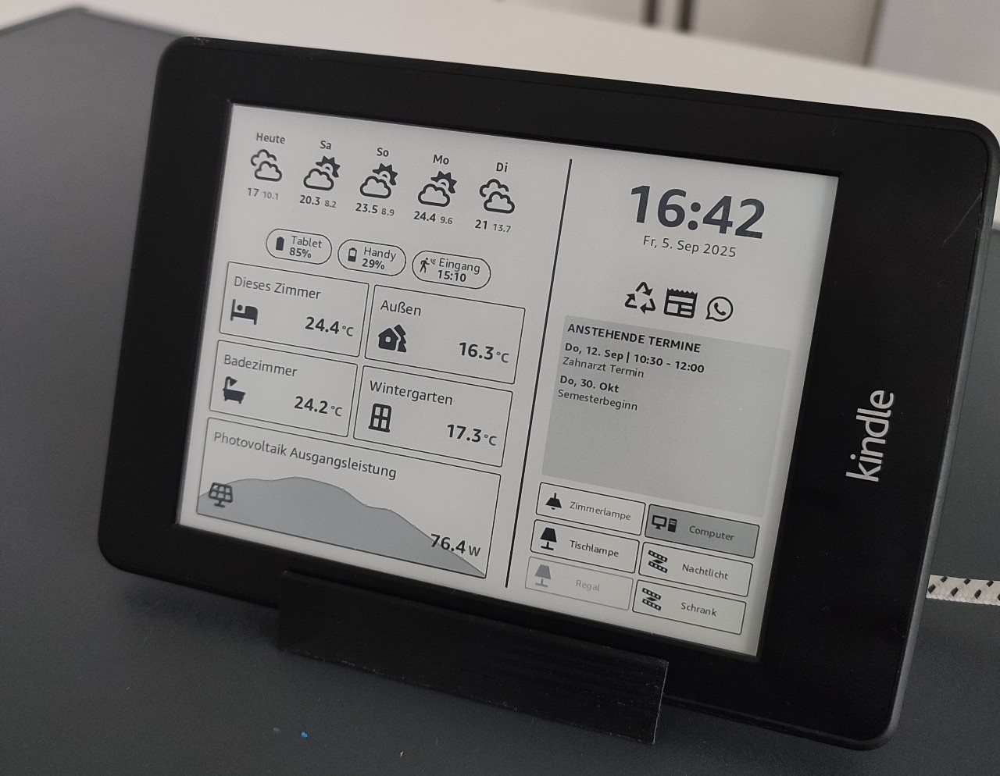
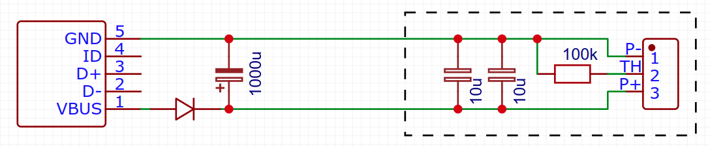

# Kindle SmartHome Dashboard

> [!WARNING]  
> This is not a finished project and will likely never be. See it only as a base for creating your own projects.

A private project of mine that turns a Kindle E-Book reader into a smarthome dashboard. The project is part of a much more complex home automation system, but this repo should include everything needed to get the dashboard part running. The KUAL extension is written in a quick and dirty fashion with most things hardcoded to my specific needs and I currently don't have the time and interest to make a real project out of it. I only have an old Kindle Paperwhite 2 (= 6. Generation) and that's also the only supported device. It might or might not work on other devices without some changes. Hope some people can do something with it. \
Underlying [Reddit Post](https://www.reddit.com/user/Im1Random/submitted/)

### Setup
#### WebSocket Proxy
The WebSocket proxy translates the old outdated WebSocket version that the Kindle uses into something that HomeAssistant understands and performs some resource intensive operations. It can be installed on any server, I'd recommend just running it on the same machine as HomeAssistant.
1. Copy the `websocket-proxy` directory to the target machine
2. Copy the `config.sample.json` to `config.json` and fill in missing values.
3. Run with `node main.js`

#### KUAL Extension
The KUAL extension includes the actual dashboard WAF and some start scripts and dependencies. Installation requires a [Jailbroken Kindle](https://kindlemodding.org/jailbreaking/) with KUAL installed.
1. Copy the `smarthomedisplay` to the `extensions` folder on your Kindle. As with most KUAL extensions do not rename.
2. Copy `mesquite/config.sample.js` to `mesquite/config.js` and fill in missing values
3. Open KUAL and start using the `Launch SmartHome Display` shortcut

### Powering the device
Since the dashboard keeps a persistent connection and prevents the Kindle from going to standby mode, the battery drains really quickly. Instead of leaving it connected to a charger all the time I would rather recommend doing a simple hardware mode that allows you to power the device without a battery. Like shown in the schematic below the 5v from the USB port are fed to the battery terminals via a diode, which will bring the voltage down to about what a full lithium battery has. Additionally lots of capacitance for voltage stabilisation and a resistor as a dummy temperature sensor are necessary to satisfy the power management chip.

